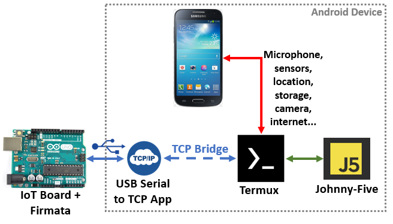

# Johnny-Five-Android-Termux
 Johnny-Five TCP script for Android devices running Termux. Works with USB-OTG connected boards.

 Based on the code snippets from [Luis Montes](https://github.com/monteslu).

## Introduction

 Johnny-Five is an outstanding library that allows the remote control of Arduino or other IoT boards using Node.js scripts running in virtually in any system.

 Android mobile phones have all the perks you would want for your Arduino board (screen, real time clock, storage, LTE/GSM, sensors, WiFi, Bluetooth, Cameras, UPS, charging circuits, microphones, etc...). Combining the processing power of an old phone with the IO ports offered by the Arduino circuits is the ultimate ecological and cheap way to have the perfect IoT device.

 This script allows Johnny-Five to run from a Termux terminal communicating with other Android apps or external devices by using the TCP protocol without root. The reason for the TCP protocol is that Termux still does not implement USB-OTG to Serial drivers, and the vanilla Johnny-Five would hang right out the box.

 If you want to connect the board in the same device using the USB-OTG port you will just need a TCP bridge application. I added bellow some free and paid options.

 

## Release notes
* Version 1.0.6 - Tested on Android with Termux 0.117 (F-Droid) and Node 14.15.4 (August 2021)

## Requirements

### Android apps
 * [Termux](https://termux.com/)
 * [ServerBridgeX](https://play.google.com/store/apps/details?id=com.cidtepole.serverbridge&hl=en) or [UART-TCP/IP Bridge](https://play.google.com/store/apps/details?id=com.t2techhub.iot.uarttcpbridge&hl=en) if the board is connected via USB-OTG

### PC apps
 * [Bitvise SSH client](https://www.bitvise.com/ssh-client-download) (optional to access the Android Termux terminal)
 * [Arduino IDE](https://www.arduino.cc/en/Main/Software) to program the Arduino board with the Firmata sketch
 * [COMbyTCP](https://sourceforge.net/projects/combytcp/) to use the PC as server (optional)

### Termux packages
 * nodejs (or nodejs-lts if not working)
 * python
 * clang
 * make
 * [openssh](https://wiki.termux.com/wiki/Remote_Access) (optional to operate the device from a PC)

## Installation
 1. Install the Firmata sketch in your Arduino/IoT board. Detailed instructions can be found [in the Johnny-Five platform pages](http://johnny-five.io/platform-support/).
 2. Install the Termux packages using the command *pkg install* followed by the name of each one of the packages:
 ```
 pkg install nodejs
 pkg install python
 pkg install clang
 pkg install make
 pkg install openssh
 ```
 3. Run ```npm install johnny-five-android-termux``` from a blank directory where you want the script to be installed
 4. Edit the *index.js* file and configure for your TCP-Serial Server host and port. Note that inside this file you have a section to include your Johnny-Five code. The default script is the famous blinking led.
 5. Test the script running ```node index.js``` from the same directory. If the TCP bridge is working, the script will be able to connect. If the Arduino board (with the Firmata firmware) is connected via USB to the phone and the USB-TCP bridge software is working, the led will start to blink.

## Node-Red integration
Node-Red, the ultimate IoT interface can be run from Termux and the following [tutorial in my web page](https://www.danbp.org/p/en/node/141) explains how to make use of Johnny-Five library in this framework.

## FAQ
* **What is the default baud rate for Firmata?**
The default value is 57600bps.

* **I only get the message "Connected to server" and nothing else**
Please check the baud rate of the server. It should be set for 57600bps.

* **Do I need to root my Android device in order to access the Arduino board using USB?**
No. Just use a USB-Serial to TCP bridge app and you are fine.

* **I can't connect to a TCP server broadcasting in my own WiFi network**
Please make sure that your Android is not running a VPN or a Firewall.

* **Running out of disk space in the Android device**
After the installation you can remove the python, clang and make packages.

## Troubleshooting
1. Install Node.js in your Laptop/Desktop and run exactly the same installation procedures above. Depending on your OS you will need additional compiling tools to setup the serial interface module.
2. Run the TCP server (like the COMbyTCP) in the same computer and try to connect between the board and the local installation of this script. If it does not work, you might have a problem with the Firmata installation in the Arduino board.
3. If the connection works, keep the TCP server running in the computer and try to connect from the mobile device. If does not work you have a connectivity problem in the Android device.
